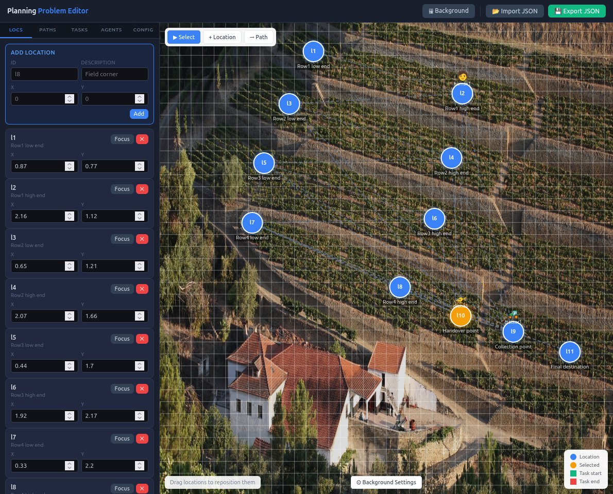

# Task scheduler

## Installation and test

Create a virtual environment and install the pinned dependencies from
`requirements.txt`:

```
python3 -m venv .venv
.venv/bin/pip install -r requirements.txt
```

Run a test scenario. Activate the environment, or run directly with
`.venv/bin/python3 src/run_generator.py <problem.json>`, for example:

```
.venv/bin/python3 src/run_generator.py examples/agriculture_simple.json
```

This generates a `.py` file containing a Google OR-Tools CP-SAT solver. To
solve it and produce a plan, run the generated file:

```
.venv/bin/python3 <generated_file.py>
```

This prints the plan to the console and also writes it to
`<generated_file>plan.txt` (e.g. `test_virtual_node_choiceplan.txt`), next to
the generated `.py` file.

## Planning problem

The planning problem is described as a JSON file.

Examples (related to the agricultural pilot) are available in
`examples/`. `agriculture_simple.json` is annotated with
`_comment_*` keys explaining each section of the format.

### Important notes

To add an "OR" dependency between tasks (perform `task_A` OR `task_B`), a
**virtual task** must be defined in the task graph: an id with no agent
assignment, whose `depends_on` lists the concrete alternatives and whose
`dependency_type` is `"OR"`. See `examples/agriculture_simple.json`
for a worked example. A concrete task (one an agent can actually perform)
must always use `dependency_type: "AND"` — the generator rejects `"OR"` there.

## UI
To help generate, modify and visualuse a planning problem, open the UI in a browser.

```
static_ui/planning_editor.html
```
The intuitive UI allows to import a planning problem (JSON file), generate one, an visualise locations, agents and paths.




## Testing and performance

`tests/test_agri_Nrows.json` files replicate the same harvest → handover →
deliver task pattern N times (one per row), each with a human-vs-drone
delivery choice. Solve time as N grows:

| Rows | Solve time              | Makespan |
|------|--------------------------|----------|
| 2    | < 1 s                    | 32       |
| 5    | ~0.6 s                   | 71       |
| 6    | ~56 s                    | 93       |
| 7    | did not finish in 5 min  | —        |

There's a sharp combinatorial wall between 6 and 7 rows (~94x slowdown from
5→6 alone), not a gradual curve. Likely cause: each row contributes an
independent human-vs-drone choice plus agent-scheduling-order freedom, and
CP-SAT has no symmetry-breaking between rows, so the search space multiplies
rather than adds as rows are appended. The generated solver also sets no
`solver.parameters.max_time_in_seconds`, so it always searches for a
*provably* optimal solution rather than returning the best one found so far.

Note: Only 2, 5, and 6 rows are included in `tests/run_tests.py`'s routine suite;
7 rows is deliberately excluded there.
